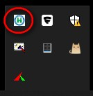
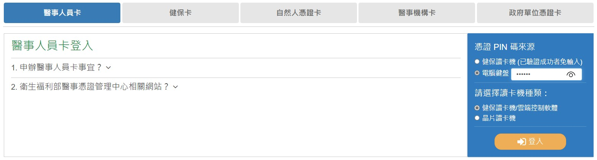
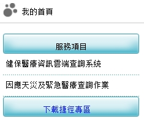
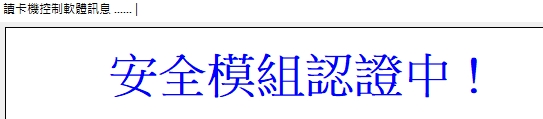

有的同仁仍不熟悉如何使用健保雲端藥歷，此篇給同仁一點參考。

---
## 步驟

1. 先確定「雲端安全模組主控台」有打開。
   
   

2. 打開桌面上的[健保局VPN](https://medvpn.nhi.gov.tw/iwpe0000/IWPE0100S01.aspx)連結。

請使用 Edge 或是 Chrome 開啟，使用 IE 常有莫名其妙的錯誤產生。

3. 使用醫事人員卡登入，在網頁右半部輸入卡片 PIN 碼後，選擇「健保讀卡機 / 雲端控制軟體」，點擊登入。
  

4. 左半部功能選單可以選擇：
    * 健保雲端藥歷系統查詢結果。
    * 因應天災及緊急醫療查詢作業。（需要該醫事人員卡有申請此功能）
  
5. 列印所需畫面即可。

---

## 疑難雜症

* 安全模組尚未與 IDC 認證：
  1. 打開 HIS 系統 -> [SYS] 共用系統 -> IC 卡共用程式。
  2. 正常會跳出「安全模組認證中」，待其跑完就可以了。
  
  3. 或者手動執行「13.SAM 與 DC 認證」，亦有相同效果。

* 卡片權限不足：
  1. 重新拔插醫事人員卡。
  2. 重新驗證 PIN 碼。