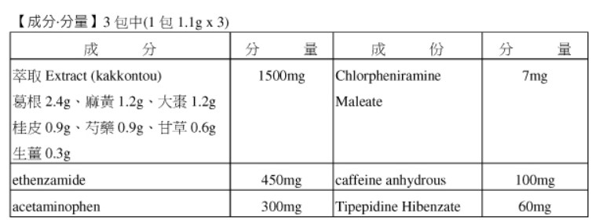
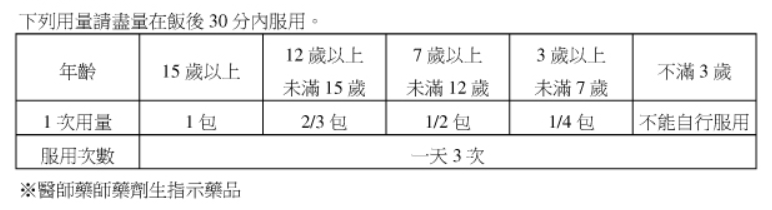

# 呼吸道疾病

## 咳嗽

永信 克風咳  

慢性咳嗽（COPD）  
風寒咳
菸咳

## 鼻水

永信 永克風

## 綜合症狀

SATO 適德寧  

德佑 風龍DX：  

專業說法： 風寒外感，項背強几几 適用  
成分：  
西藥是低量的 Acetaminophen 和消炎成分及低量的抗過敏和止咳配方。  
中藥是葛根湯萃取物、麻黃、大棗、芍藥、桂枝、將、甘草等。  
特點：中藥 + 西藥。適用於冬天感冒或是長在冷氣房中所致（冷到），症狀為頭痛身疼，發熱畏寒無汗，感冒造成的肩頸僵硬可用。裡面中藥成分會發汗，稍微流個汗症狀就會緩解。  
（適用在這次疫苗後的輕微感冒不適症狀！）  
如果是夏天且非於冷氣房內冷到的話，慎用，可能會因為裡面的熱藥導致大出汗而虛弱。  
##G6PD 缺乏不適用

## 流感

tamiflu

## 喉嚨痛

冬天的感冒，特點是畏寒發熱然後後頸會緊（項背強几几），常用桂枝湯。如果伴隨有痛，通常是前額或正面的地方可以用葛根湯

喉片、蜂膠

# 中暑

電解水、acetaminophen

## 熱中暑

## 夾濕的中暑

## 陰暑

2.夏天感冒分為一般的熱中暑、有夾濕的中暑、陰暑（出入冷氣房被冷到的），夾濕常見烙賽可以用藿香正氣散的成藥，熱中暑就是用救濟水或白虎湯類，陰暑可以用類似桂枝湯的

表癥： 頭暈、頭痛、無力虛弱、大量出汗、皮膚溼冷、臉色蒼白、心跳加速、姿勢性低血壓、噁心嘔吐、肌肉抽筋
電解質失衡則補充電解質水，物理性降溫

# 腸胃疾病

益生菌

## 腹瀉

Loperamide

## 腹脹

kascoal

## 絞痛

## 胃酸過多

# 皮膚疾病

## 異位性皮膚炎

## 脂漏性皮膚炎

# 疼痛

## 牙痛

## 肌肉痠痛

# 女性疾病

## 養顏美容

## 泌尿道感染

## 陰道炎

## 更年期症狀

## 月經

## 懷孕 & 哺乳

## 貧血

## 減肥

# 男性疾病

老人腎虛頻尿

5.老人腎虛的頻尿可以用桑螵蛸散（是叫膀胱丸嗎？），他可以補腎固腎陽而固精縮尿（這可以台詞可以記XD）

***需鑑別出是否有UTI導致的頻尿，排尿有熱痛需考慮清楚。或由濕熱所困導致膀胱排尿異常的不適合用（這個要怎麼鑑別我還在學XD），應該會加減見到大便也不暢，也許會有點拉肚子或大便成稀狀

攝護腺問題可用，南瓜子

荷爾蒙問題可用，瓜拿納和馬卡

# 眼睛保健和疾病

## 眼睛乾澀、紅癢

# 失眠

睡眠的，如果是思慮過度導致睡不著淺眠，可以用酸棗仁湯類，昨天我們討論的那隻，可能是年輕人常見

芝麻素(芝麻明衣)，酸棗仁，甜甜夢

褪黑激素，diphenhydramine，CHLORPHENIRAMINE

非管藥處方，mesyrel,remeron,seroquel

4.睡眠如果是老人家失眠常見可能是肝腎陰虛的情況導致的淺眠，可以用天王補心丹類（安腦神這隻）

中美 安腦丸？YES！

# 痛風

# 骨質疏鬆 & 關節炎

# 心血管

## 高血壓

## 高血脂

## 高血糖

# 保肝

# 記憶力 & 腦循環

神經滋養物質 PPLS、BDNF

食補

夏天很簡單 就是青草茶，可以加菊花 薄荷 荊芥

秋天節氣是燥 就潤肺 可用一些杏仁茶加上潤肺的藥 不過那些可以用 就要查法規XD

冬天體質較寒的可以用薑茶加一些桂皮，比較燥熱者可以搭配一些潤肺的藥材

所以可以考慮各季節茶包先以一種當主體，若有體質特殊的可以令給一包作加減用？

安心藥材

# 可參考廠商

1. 丹淨
2. 菁園
3. 港香蘭
4. 中美
5. 華貿行