## 組成
* 雌激素（常見的是 Ethinyl estradiol）的劑量差別：
  * ＜0.03 超低劑量  
  * 0.03 低劑量  
  * 0.03-0.05 中劑量  
  * ＞0.05 高劑量，現已停用  
劑量越高越容易產生副作用，如噁心、嘔吐、不適感、情緒起伏等狀況。  
* 黃體素：  
  * 第一代：Norethindrone acetate、Ethynodiol diacetate、Lynestrenol、Norethynodre。  
  * 第二代：Levonorgestrel（LNG）。  
    * 低劑量便能有避孕效果。
    * 由 Testosterone 的結構修飾而來，故有較強的雄性化作用，容易導致痤瘡及多毛症等症狀。  
  * 第三代：Desogestrel、Gestodene、Norgestimate。  
    * 由二代黃體素 LNG 修飾化學結構而來，雄性化作用減弱，相較於第二代，痤瘡及水腫的副作用較小。  
    * 血脂也得到較好的控制，如 desogestrel 可減低 LDL 達 15%，而 HDL 也會增加。  
  * 第四代：Cyproterone acetate（CPA）或 Drospirenone（DRSP）。  
    * 抗雄性化作用（Anti-androgenic）：痤瘡、皮膚出油、毛孔阻塞的狀況減少，故部分藥品亦被核准用於同時有避孕需求的青春痘治療用途。  
    （CPA 擁有最強的抗痤瘡能力。）  
    * 抗礦物皮質酮作用（Anti-mineralocorticoid）：改善水腫現象。  
    （DRSP 從 Spironolactone 的結構修飾而來，可抗水腫。）  

---

## 表格比較  
| 黃體素代數 ------------------ 雌激素劑量 | 1st Norethindrone | 2nd Levonorgestrel (LNG) | 3rd Desogestrel (DSG) Gestodene | 4th Drospirenone (DRSP) Cyproterone (CPA) |
|---|---|---|---|---|
| 0.02 | **美婷娜** Norethindrone 10 + EE 0.02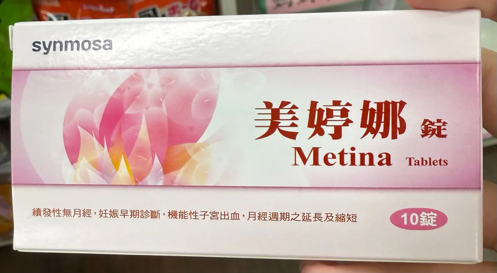 | - | **美適儂** 21+7 DSG 0.15 + EE 0.02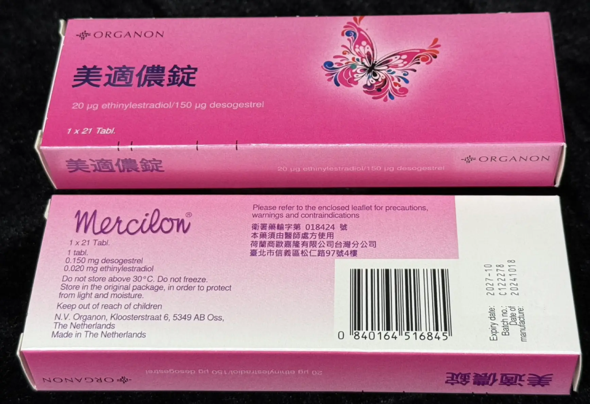 **玫麗安** 21 Gestodene 0.075 + EE 0.02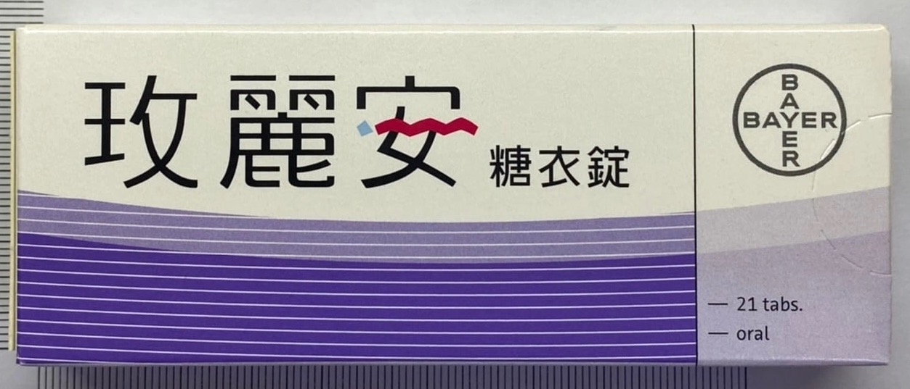 **愛月定錠** 21 Gestodene 0.075 + EE 0.02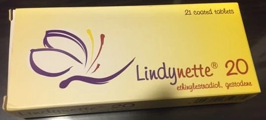 | **悅姿** 24+4 DRSP 3 + EE 0.02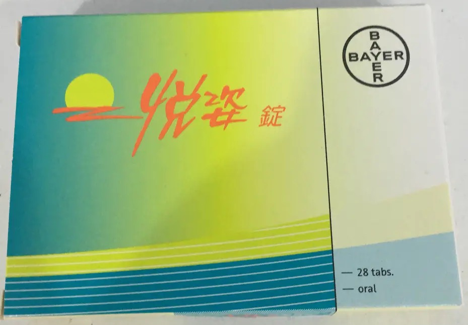 **愛薇** 24+4 DRSP 3 + EE 0.02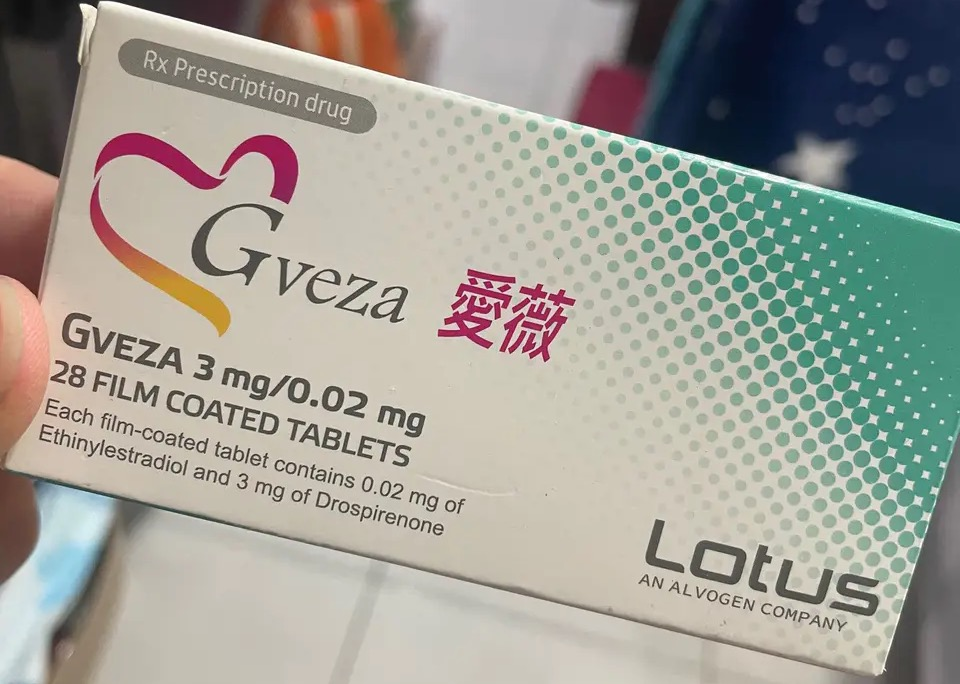 |
| 0.03 | - |**欣無妊** 21 LNG 0.15 + EE 0.03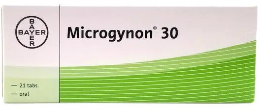 **家計 2 號** 21+7 LNG 0.15 + EE 0.03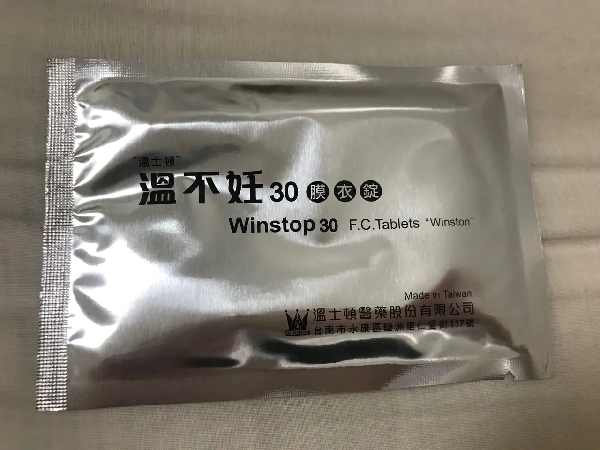 | **祈麗安** 21 Gestodene 0.075 + EE 0.03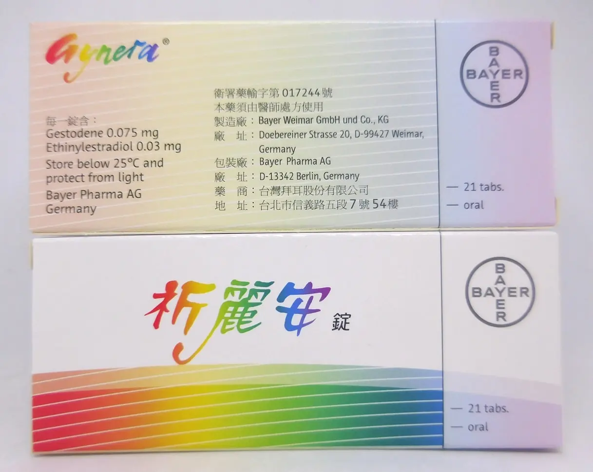 | **悅己** 21 DRSP 3 + EE 0.03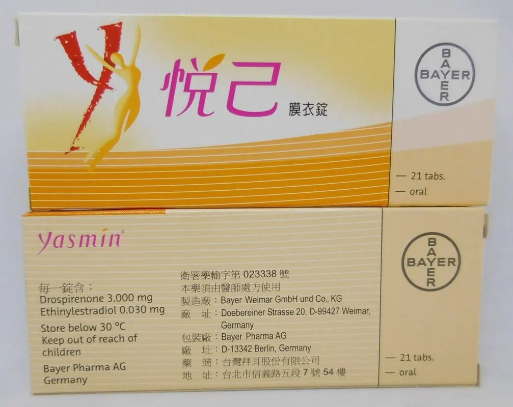 **愛己** 21 DRSP 3 + EE 0.03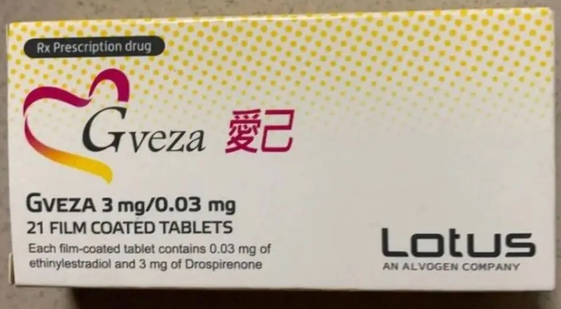 |
| 0.035 | - | - | - | **黛麗安** 21 CPA 2 + EE 0.035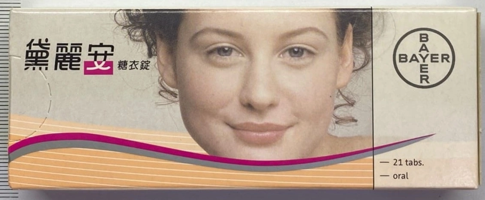 **愛斯麗安** 21 CPA 2 + EE 0.035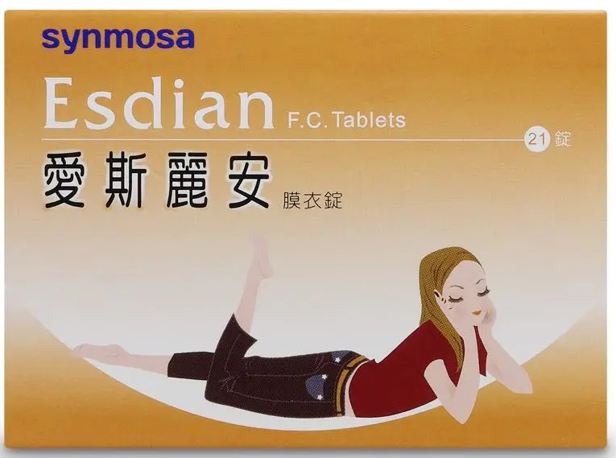 |
| 0.04 | - | **家計 1 號** （三段式） LNG 0.05 + EE 0.03 LNG 0.075 + EE 0.04 LNG 0.125 + EE 0.03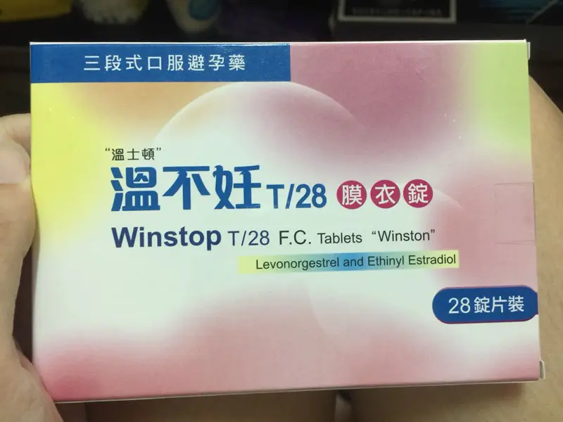 | - | - |
| 0.05 | - | **家計 4 號** 21+7（已停用） LNG 0.125 + EE 0.05 **家計 3 號** 21+7（已停用） LNG 0.25 + EE 0.05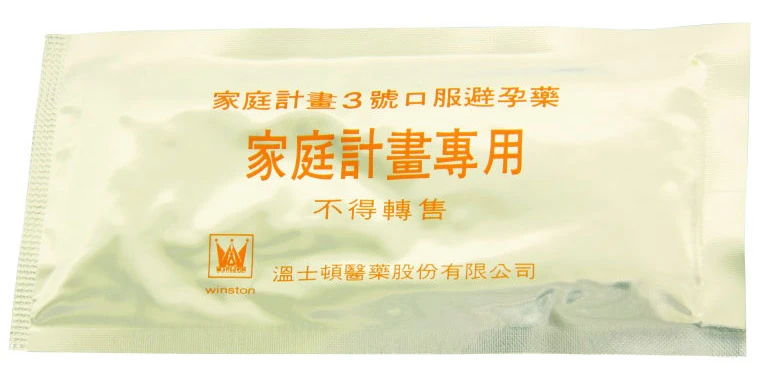 | - | - |

---

### Alyssa 愛莉莎膜衣錠  
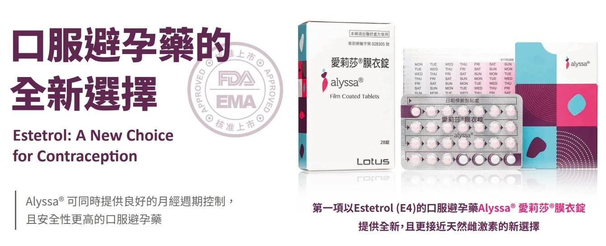
* 愛莉莎 24 + 4。  
* DRSP 3 + E4 15。  
* 含新型的雌激素 Estetrol (Estetrol monohydrate，E4)，較不影響凝血功能（血栓風險降低）、減少對乳房刺激（乳癌風險較低），且其代謝方式與大部分藥品不同（不經由 CYP3A4 代謝），藥物食物交互作用少。  
Drospirenone（DRSP）仍然會影響血液凝集，具有血栓風險，同時也會經由 CYP3A4 代謝，仍然要注意藥物食物交互作用。  

---

## 副作用  
* 雌激素：噁心嘔吐、乳房脹痛。  
* 黃體素：痤瘡、多毛症、體重增加、水腫。  
* 血栓風險：  
傳統的雌激素（Ethinyl estradiol）及新型黃體素 Drospirenone（DRSP）研究顯示會影響凝血功能，可能會產生深層靜脈血栓（DVT）的嚴重不良反應，尤其若有血栓家族病史的人千萬不可擅自服用。  
此外，心血管高風險族群，例如抽菸、肥胖、三高病史，合併使用事前避孕藥，會額外增加心血管事件的產生，又以抽菸且大於 35 歲女性需要特別注意。  
* 乳癌：  
傳統的雌激素（Ethinyl estradiol）會作用於乳房的上皮細胞，若有乳癌家族史的高風險族群，則建議避開傳統的雌激素。  

---

## 21 錠與 28 錠的差異？  
* 21 錠裝：每一顆皆為活性錠，服用完畢有 7 天的停藥期，將會有月經來的現象，等過完 7 天後再開始服用下一盒。  
* 28 錠裝：分為 21 顆活性錠 + 7 顆安慰劑，或是 24 顆活性錠 + 4 顆安慰劑。  
  * 21 + 7：與 21 錠裝事前避孕藥一樣，優點為可養成每天服藥的習慣不需停藥 7 天。  
  * 24 + 4：可養成每天服藥的習慣不需停藥 7 天，且 Hormone-free（無賀爾蒙作用）的天數由 7 天減少為 4 天，能夠更穩定體內賀爾蒙的波動，減少經前症候群如腹脹、水腫及乳房脹痛的不適感，亦更能提高抑制排卵的效果。  

---

## 服用方式  
* 月經來潮第 1-5 天時開始服用，由於月經在這 5 天排卵的機率極低，所以建議在此段期間開始服藥，抑制排卵的效果最佳。  
* 「首次」服用需持續一週以上，待體內黃體素達到穩定濃度後才具有避孕效果，故建議開始服用第一週需配合保險套做雙重避孕，並固定每天同一時間服用，好處是建立服藥習慣，同時也讓體內的賀爾蒙濃度維持恆定。  

---

## 事前及事後差別  
* 事前避孕藥：透過長期服用以預防受孕，經長時間且週期性服用低劑量的賀爾蒙（雌性素與黃體素），以抑制腦下垂體分泌黃體成長激素（LH）與濾泡刺激素（FSH），進而抑制排卵、干擾內膜生長（胚胎不易著床）、增加子宮頸黏液（精蟲不易游動），來達到避孕的效果。  
* 事後避孕藥：為「行房事後」一次性服用的避孕藥，原理為單次服用高劑量黃體素，然後突然停止，子宮內膜就會以為黃體衰竭而造成內膜剝落（月經來潮），以阻止胚胎著床發育，來達到避孕的效果。  

---

## 催經與延經  
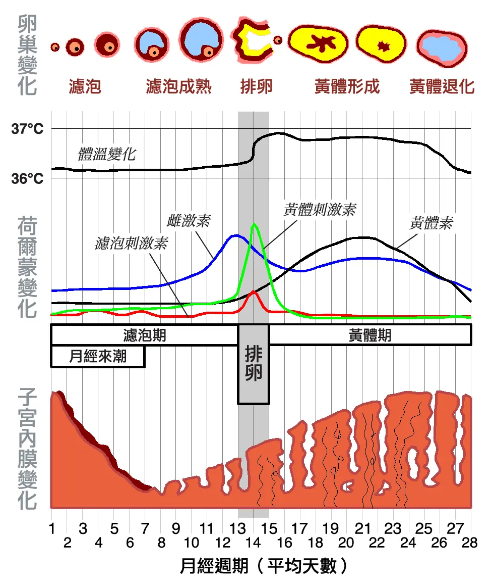
* 排卵後（真正的催經）：正常排卵後，身體等待受孕的階段（黃體期）所進行的干預。  
  * 原理：  
    * 排卵後，卵巢會形成黃體，開始分泌大量的黃體素。可穩定並增厚子宮內膜，為可能著床的受精卵做準備。  
    * 如果沒有懷孕，黃體會在大約 14 天後萎縮，黃體素濃度急劇下降。  
    * 子宮內膜失去了黃體素的支撐，就會開始剝落、出血，而成月經。  
    * 在排卵後服用催經藥（通常是高劑量黃體素），然後停藥，就是人為地模擬這個「黃體素急劇下降」的過程，從而引發「撤退性出血」(Withdrawal Bleeding)，看起來就跟月經一樣。  

催經服用方式：於排卵日後，連續服用 3-5 天黃體素藥物，停藥後約 3-7 天內來潮。

延經服用方式： 預定來潮前 3-5 天開始服用，Medroxyprogesterone 5mg（Provera&reg）1# BID 直至目標日停藥，1-2 日後即來潮。 
美婷娜 Metina 則是 1# QD 直至目標日停藥，1-2 日後即來潮。

不建議延超過一週（易失敗）。 
無避孕效果。

* 排卵前（實為調經或抑制排卵）：在卵泡還在發育，尚未排卵的階段（卵泡期）就開始用藥。  
  * 原理：  
    * 在排卵前，身體需要一個「黃體化激素（LH）」的高峰來刺激卵巢排卵。  
    * 如果在排卵前就給予外來的黃體素（或是雌激素 + 黃體素，如事前避孕藥），會產生負回饋作用，抑制腦下垂體分泌 LH，從而阻止或延後排卵。  
    * 因為沒有排卵，身體就不會進入自然的黃體期，原有的月經週期就被打斷了。子宮內膜的增厚和剝落將會由服用藥物來決定。  
  * 適用情境：  
    * 調經：對於月經週期混亂的人，醫師會用這種方式（最常見的就是使用事前避孕藥）來抑制患者自身混亂的荷爾蒙，建立一個規律的人為週期。  
    * 延經：持續服用含有黃體素的藥物，不讓荷爾蒙下降，子宮內膜就會一直維持穩定而不剝落，達到延後月經的目的。  
  * 效果： 這並非「催促」當次的月經到來，而是 **「中斷」並「重設」** 目前的月經週期。停藥後發生的出血同樣是撤退性出血，但其前提是抑制了自然的排卵過程。  

調經服用方式： 於前一個月經後 3-5 日，開始連續服用口服單相避孕藥，並於預計出遊日前，繼續服用活性錠，直至目標日停藥或改服安慰劑，1-2 日後即來潮。 

成功率高。 
適合提早準備的人。 
可延一週以上。 
副作用：下次經血量較大、經期不規則。

---

## Reference
[未成年懷孕求助網站](https://257085.sfaa.gov.tw/knowledge_detail.php?Key=27)  
[未成年懷孕求助網站](https://257085.sfaa.gov.tw/knowledge_detail.php?Key=62)  
[明朗身心診所](https://www.moodlight.com.tw/blog/detail/95)  
[新竹馬偕醫院衛教資訊](https://www.hc.mmh.org.tw/upload/health/口服避孕藥簡介-吳季陶醫師.pdf)  
[臺大醫院旅遊醫學教育訓練中心](https://travelmedicine.org.tw/information/content.asp?ID=147)  
[Wikipedia](https://zh.wikipedia.org/zh-tw/月經週期)